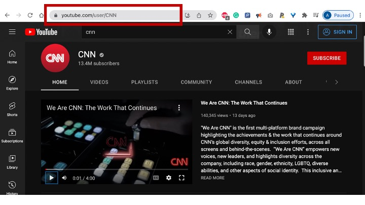
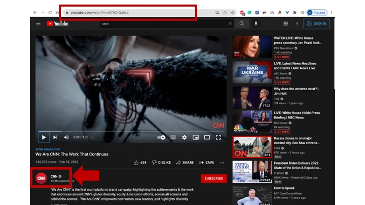
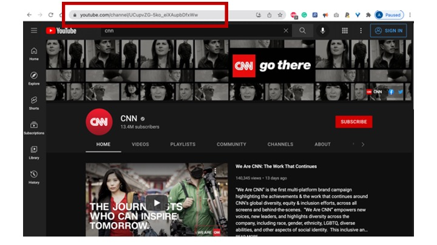

# youtube-stat2data

`youtube-stat2data` is a small research utility for collecting public video
metadata from a YouTube channel and exporting the results as a CSV file. It was
created for computational media research and uses the YouTube Data API v3.

> **Project status:** This repository is a research prototype last developed in
> 2022. The script is preserved for transparency and reuse, but YouTube API
> behavior, quotas, and available fields may have changed. Review the current
> API documentation before using it in a new study.

## Output

The script exports one row per video, with fields for:

- title
- video ID
- description
- publication date
- like count
- favorite count
- view count
- comment count

Some statistics may be unavailable because of video settings or API changes.

## Requirements

- Python 3
- `pandas`
- `google-api-python-client`
- a Google Cloud project with the YouTube Data API v3 enabled
- one or more YouTube API keys

Install the Python dependencies with:

```bash
python -m pip install pandas google-api-python-client
```

## Setup

1. In the [Google Cloud console](https://console.cloud.google.com/), create or
   select a project.
2. Enable the
   [YouTube Data API v3](https://console.cloud.google.com/apis/library/youtube.googleapis.com).
3. Create an API key and restrict it to the APIs and environments needed for
   your project.
4. Open `youtube-stat2data-for-public.py` and replace the example placeholders
   in `DEVELOPER_KEY`, `channel_id`, and the list of years.

Never commit API keys to GitHub. For new or shared research code, prefer loading
credentials from environment variables or another secret-management system.

## Finding a channel ID

A channel ID is not always the same as the channel name shown in a YouTube URL.
Open a video from the channel, select the channel name, and inspect the channel
page URL. In a URL such as:

```text
https://www.youtube.com/channel/UCupvZG-5ko_eiXAupbDfxWw
```

the final segment is the channel ID. The screenshots below illustrate the
workflow used when this project was created:

1. Open the channel page.

   

2. Open a video and select its channel name.

   

3. Read the channel ID from the resulting URL.

   

## How collection works

The script queries the channel one month at a time for the requested years,
follows paginated search results, retrieves video statistics in batches, and
writes the combined table to `youtube-data.csv`.

For large collections, consult Google's current quota documentation. Multiple
API keys should only be used in accordance with Google Cloud and YouTube API
policies; do not use key rotation to evade quota or usage restrictions.

## Research-use notes

- Record the collection date, channel ID, requested date range, query settings,
  and software version in your research documentation.
- Treat counts as time-dependent observations rather than permanent facts.
- Check applicable platform terms, institutional requirements, and research
  ethics obligations before collecting, storing, or sharing data.
- Do not commit downloaded datasets if they contain restricted, sensitive, or
  unpublished research material.

## Limitations

- Search results and metadata availability are controlled by the YouTube API.
- Deleted, private, unlisted, region-restricted, or otherwise unavailable videos
  may be absent.
- Metrics can change after collection.
- The current script is configured by editing placeholders in the source file;
  it does not yet provide a command-line interface or automated tests.

## License

Distributed under the [MIT License](LICENSE).

## Author

Heesoo Jang — [website](https://heesoojang.com/)
