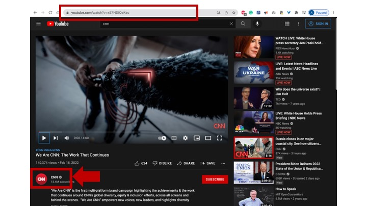

<!-- ABOUT THE PROJECT -->
# 📥 youtube-stat2data
`youtube-stat2data` lets you easily download the list of videos and their metadata

(<a href="#top">back to top</a>)

# Description
- Interested in downloading a set of metadata from videos of a specific Youtube channel? 
- `youtube-stat2data` is a simple tool that is solely built for that purpose.
- With just the channel ID, you can get a full list of meta data including `title`, `published date`, `video_description`, `view_count `, `like_count`, `favorite_count `, and `comment`.
- `youtube-stat2data` uses YouTube Data API (v3) and Youtube Analytics API. 

(<a href="#top">back to top</a>)

<!-- GETTING STARTED -->
# Getting Started
To use `youtube-stat2data`, you need to know your Youtube API Key(s) and the channel ID of the Youtube channel you want to get data from.

## How to get Youtube_API_Key(s)
- Go to [Google Cloud Platform](https://console.cloud.google.com/apis/credentials?project=omega-booster-261021) and click on create credentials icon to receive an API key. You will have to create at least three credentials if you're pulling data from more than 5,000 videos.
- Then, go to [API library](https://console.cloud.google.com/apis/library?project=omega-booster-261021) to enable the two API libraries you need for pulling Youtube data: [YouTube Data API (v3)](https://console.cloud.google.com/apis/library/youtube.googleapis.com?project=omega-booster-261021) and [Youtube Analytics API](https://console.cloud.google.com/apis/library/youtubeanalytics.googleapis.com?project=omega-booster-261021). 

## How to get the channel ID
`channel_id` you would use to pull the metadata is different from the name of the channel. 

1. If you go to the homescreen of a Youtube channel, the URL link will include the name of the channel.
For example, the url link of CNN's Youtube channel is youtube.com/user/CNN in the following screenshot.

2. Click on one of the videos of the youtube channel. The new URL link is for that specific video (the red box). Click on the name of the channel below the video, which is the one directed by the red arrow in the image below.

3. You are now back on the homescreen of the Youtube channel again, but you get a different URL. The last part of this URL is the channel ID. For example, the new URL link for CNN's Youtube channel is https://www.youtube.com/channel/UCupvZG-5ko_eiXAupbDfxWw (see image below). The channel ID for CNN's Youtube channel is  `"UCupvZG-5ko_eiXAupbDfxWw"`.

(<a href="#top">back to top</a>)

<!-- LICENSE -->
# License

Distributed under the MIT License. See `LICENSE.txt` for more information.

(<a href="#top">back to top</a>)

<!-- CONTACT -->
# Contact

Heesoo Jang - [@HeesooJang2](https://twitter.com/HeesooJang2)

(<a href="#top">back to top</a>)

